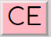
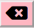
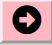
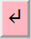
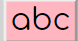

<h1 align="center"> WhatsapGram Maite</h1>

 Una pequeña visión de como se visualiza la aplicación:

 

## Tabla de contenidos:
---
- [Descripción y contexto](#descripción-y-contexto)
- [Guía de usuario](#guía-de-usuario)
- [Dificultades del proyecto](#Dificultades-del-proyecto)
- [Mejoras del proyecto](#Mejoras-proyecto)
- [Autor/es](#autores)

## Descripción y contexto
---
WhatsapGram consiste en una pequeña aplicación de mensajeria que permite enviarte mensajes a ti mismo. El estilo y el formato puede recordarte a whatsapp,puesto que cualquier parecido con la realidad es pura coincidencia.
Dicho esto, e teclado se ha hecho con un estilo retro alejandose de los teclados convencionales del móbil. Con este teclado usted podrá realizar diferentes funcionalidades que seguramente reconocerá en un móbil y además podrá enviarse mensajes así mismo.

## Guía de usuario
---
**Funcionalidades:**

El teclado:

 

- Posibilidad de escribir como si fuera un mobil al hacer click en cada botón.
- 
Con esta tecla se borra todo: 

- 
 Con está tecla borras la ultima palabra cada vez que haces click encima de la tecla

- 
 Con está tecla borras la última letra

- 
 Con está tecla borras la primera letra

- 
 Con está tecla creas un salto de linea que posteriormente se visualizará cuando se envie

    -Así se visualiza en el input:
    

 
    -Así se visualiza en el apartado de mensajes:
    

 
- 
 Con está tecla cambiamos de minusculas a mayusculas con un click y con dos clicks cambia a mayusculas permanentes

Botones:
- Al hacer click en este botón lo que se haya escrito en el input creará un div con un estilo y un formato, además de añadir la hora de envio:
  

- 
Este boton es una mejora del proyecto y permite añadir emojis, al pulsar el boton cambia el icono a un teclado y viceversa: 

 
  -Como se visualiza si se hace click encima de el:
  

## Dificultades del proyecto
---
**Entre otras dificultades que me he encontrado son las siguientes:**
*Css:*
-Ajustar el grid y compaginarlo con el display flex.
- Que se ajustará a las medidas que yo deseaba con el media query y no se me moviese el teclado.

*JavaScript*
- Que el botón de CE funcionase tanto para teclado como escrito al hacer clicks en los diferentes divs, se solucionó utilizando un replace.
- Que el botón de mayusculas funcionase, aunque funciona siempre y cuando escribamos algo siempre pasa por los tres estados aunque no quiera. Esta funcionalidad no la he podido resolver del todo.
- El salto de linea. Al principio utilicé un replace pero al ser un input y no había realizado el teclado con innerHTML no me detectaba el salto de linea y me lo cogía como si fuera un string entero omitiendo   o \n por lo que tuve que hacer una función para que me pudiera realizar el salto de linea(para mas información puede consultar el código de js)

## Mejoras del proyecto
---
- Creado un botón de iconos que añade iconos al input (ya explicado más arriba).
- Cuando se envia un mensaje realiza un scrolldown.
- En css cuando el media query está mas de 500 aparece un scroll modificado que visualmente es de color de rosa.
## Autor/es
---
Maite Ladaria Sanchez
